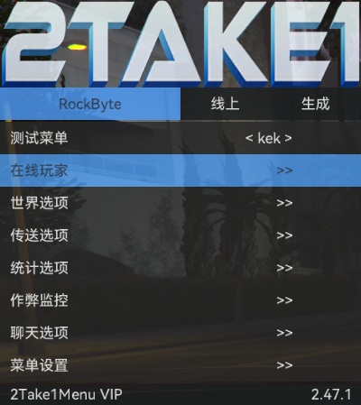

# RockByte

简体中文 | [English](./README_EN.md)

为 2take1 用户开发的一个 lua 脚本，主要目标是提供快捷任务、提升公共战局体验

本项目参考了一些 [Keks-menu](https://github.com/kektram/Keks-menu) 的写法和用法。

# 快速开始

### 依赖

+ 2take1 menu

### 使用说明

1. 下载当前项目
2. 将脚本放入 %APPDATA%\PopstarDevs\2Take1Menu\scripts 目录中
3. 进入游戏加载脚本即可

# 运行样例

### 功能预览

+ 在线玩家
  + 指定玩家
    + 传送佩里科岛
    + 传送日蚀公寓
    + 到我面前(目标在载具中有效)
    + 游戏崩溃
+ 世界选项
  + 控制范围
  + NPC自动死亡
  + NPC自动移除
  + NPC自动传送面前
  + NPC自动冻结
  + 物品自动传送面前
+ 传送选项
  + 自动传标记点
  + 向前闪现
  + 传送到虎鲸
+ 统计选项
  + 增加在线时长
  + 减少在线时长
+ 作弊监控
  + 开启监控
  + 实时显示
  + 记录日志
  + 每行玩家个数
  + 字体大小
  + 行高倍数
  + RD
  + GN
  + BU
  + 不透明度
  + 检测间隔ms
+ 聊天选项
  + 警告喊话（未完成）
    + 开启警告（未完成）
    + 短信喊话（未完成）
    + 公屏喊话（未完成）
  + 聊天审判
    + 开启审判
    + 崩溃方式
    + 是否通知
    + 添加关键字
+ 抢劫选项
  + 公寓抢劫
    + 修改分红
  + 名钻赌场
    + 修改分红
  + 佩里科岛
    + 修改分红
  + 末日豪劫
    + 修改分红
+ 菜单设置
  + 保存设置