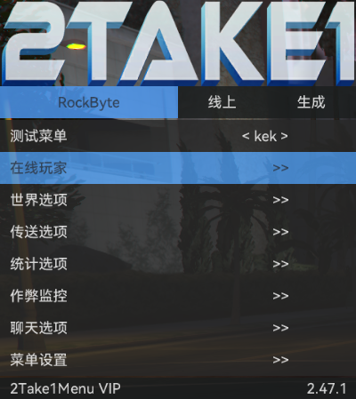

# RockByte

[简体中文](./README.md) | English

A lua script developed for 2take1 users with the main goal of providing quick tasks and improving the public battlefield experience

This project is based on some [Keks-menu](https://github.com/kektram/Keks-menu) writing and usage.

# Quick start

### Required

+ 2take1 menu

### Usage

1. Download the current project
2. Put the script into %APPDATA%\PopstarDevs\2Take1Menu\scripts directory
3. Start the game and load the script

# Example

### Feature Preview

+ Online Players
  + Designated Players
    + Teleport to Perico Island
    + Teleport to Eclipse Apartment
    + Get to me (target is valid in carrier)
    + Game crash
+ World options
  + Control range
  + NPC auto-death
  + NPC auto-removal
  + NPC auto teleportation in front of
  + NPC auto-freeze
  + Item auto-transfer front
+ Teleportation options
  + Auto pass marker point
  + Flash forward
  + Teleport to orca
+ Statistic options
  + Increase online hours
  + Decrease online time
+ Cheat monitoring
  + Turn on monitoring
  + Real-time display
  + Record logs
  + Number of players per line
  + Font size
  + Row height multiplier
  + RD
  + GN
  + BU
  + Opacity
  + Detection interval ms
+ Chat options
  + Warning shout (incomplete)
    + Turn on warning (incomplete)
    + SMS shout (incomplete)
    + public screen shout (incomplete)
  + Chat Trial
    + Open trial
    + Crash mode
    + Whether to notify
    + Add keyword
+ Robbery option
  + Apartment heist
    + Modify bonus
  + Famous Diamond Casino
    + Modify Bonuses
  + Perico Island
    + Modified Bonuses
  + Doomsday Heist
    + Modify Bonuses
+ Menu settings
  + Save Settings
