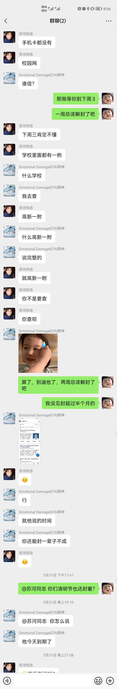
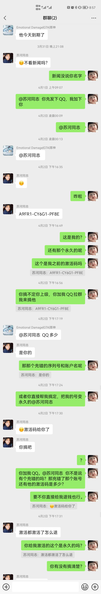
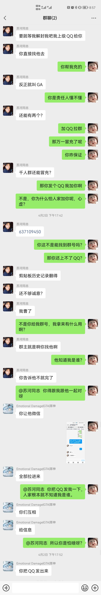

# RockByte

[简体中文](./README.md) | English

A lua script developed for 2take1 users with the main goal of providing quick tasks and improving the public battlefield experience

This project is based on some [Keks-menu](https://github.com/kektram/Keks-menu) writing and usage.

# Quick start

### Required

+ 2take1 menu

### Usage

1. Download the current project [Quick Entry](https://github.com/0xn0ne/RockByte2take1/releases)
2. Put the script into %APPDATA%\PopstarDevs\2Take1Menu\scripts directory
3. Start the game and load the script

# Example

### Feature Preview

+ Online Players
  + Designated Players
    + Teleport to Perico Island
    + Teleport to Eclipse Apartment
    + Get to me (target is valid in carrier)
    + Game crash
+ World options
  + Control range
  + NPC auto-death
  + NPC auto-removal
  + NPC auto teleportation in front of
  + NPC auto-freeze
  + Item auto-transfer front
+ Teleportation options
  + Auto pass marker point
  + Flash forward
  + Teleport to orca
+ Statistic options
  + Increase online hours
  + Decrease online time
+ Cheat monitoring
  + Turn on monitoring
  + Real-time display
  + Record logs
  + Number of players per line
  + Font size
  + Row height multiplier
  + RD
  + GN
  + BU
  + Opacity
  + Detection interval ms
+ Chat options
  + Warning shout (incomplete)
    + Turn on warning (incomplete)
    + SMS shout (incomplete)
    + public screen shout (incomplete)
  + Chat Trial
    + Open trial
    + Crash mode
    + Whether to notify
    + Add keyword
+ Robbery option
  + Apartment heist
    + Modify bonus
  + Famous Diamond Casino
    + Modify Bonuses
  + Perico Island
    + Modified Bonus
    + Mode
    + Objectives
    + Secondary Objectives
    + Approaching vehicles
    + Weapons
    + Truck location
    + Scouting points of interest
    + All jamming
    + Write data
  + Doomsday Hojack
    + Modify dividends
+ Menu settings
  + Save settings

# Search Notice

I really did not expect that I bought a 2T was cheated, take the monthly card to me as a permanent card sold. I was so surprised to see that he was a student and held on to a sliver of trust like a fool. The personal level is limited, can not trace to this person real information, if any big brother see request help to find the identity of the scammer.

+ Nickname: SuHeyi
+ SCID: 130349842
+ real name: \*柳城 (not sure if the real name)
+ WeChat ID: wxid_5oaz4hf2cbm512
+ WeChat name: 苏河同志
+ Place of origin: Kunming, Yunnan

